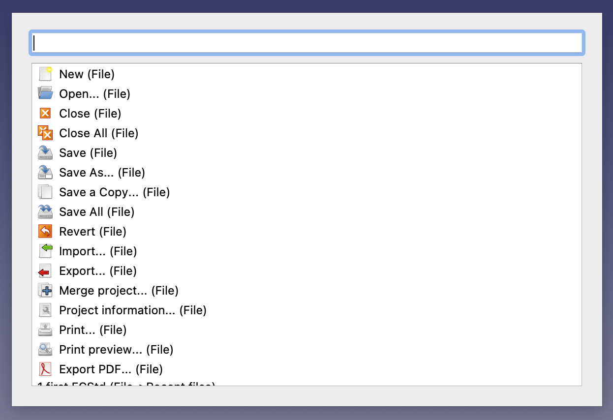

# ComandPalette Addon
Command Palette is a FreeCAD macro for quickly searching and executing menu actions.

## Basic Operation
- Add the CommandPalette macro to a global toolbar, then add a keyboard shortcut. (`Shift-Space` or `Ctrl-Space` recommended.)
- Press your assigned keyboard shortcut and type in name of the command you're looking for in the search box. Press the up or down arrows to select the item if necessary, then press enter to trigger the action.
- The Command Palette can be dismissed by pressing `Esc`.

## Usage Notes
- Actions are drawn from the available menu items. The menu path to each action is displayed in parenthesis.
- Comand Palette uses a simple fuzzy search: each word in the search box is matched independently. (E.g. searching for "con hori d" will match "Constrain horizontal distance".)
- Keyboard shortcuts and additional details are displayed in the hover tooltip when you mouse over an action.
- Currently, disabled menu items are not displayed.

## Developer

Day Fisher ([@ddfisher](https://github.com/ddfisher))

## License

LGPL-2.1 ([LICENSE](LICENSE))
